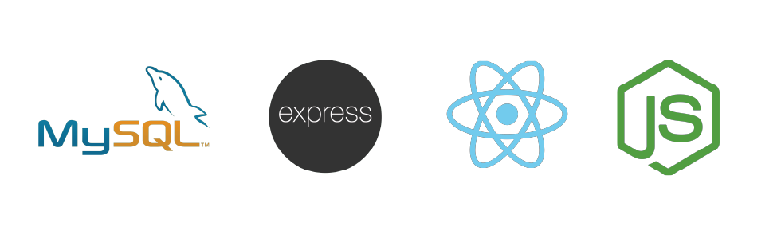
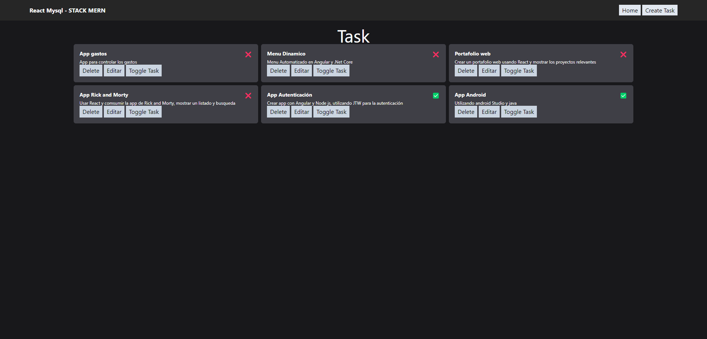
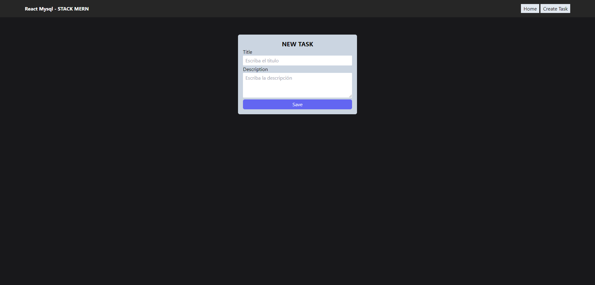

# React - Stack MERN

Este proyecto fue desarrollado como parte de un curso en [FaztWeb](https://www.youtube.com/watch?v=dJbd7BYofp4), el cual me brindó una valiosa experiencia y conocimientos en el desarrollo de aplicaciones web con el stack MERN (MySQL, Express, React y Node.js).

## Descripción

La aplicación es un sistema CRUD (CREATE - READ - UPDATE - DELETE), que engloba las operaciones fundamentales para la gestión de datos. Además, se ha empleado [Tailwind CSS](https://tailwindcss.com/) para el diseño web, aprovechando sus potentes utilidades para estilizar la interfaz. Para construir formularios en React, se ha incorporado [Formik](https://formik.org/), una destacada biblioteca que facilita esta tarea. Todo el proyecto ha sido desarrollado utilizando [Vite](https://es.vitejs.dev/) como entorno de creación, lo que ha permitido una configuración ágil y eficiente.

## Tecnologías utilizadas

- [MySQL](https://www.mysql.com/)
- [Express](https://expressjs.com/)
- [React](https://reactjs.org/)
- [Node.js](https://nodejs.org/)

## Capturas de pantalla

-
